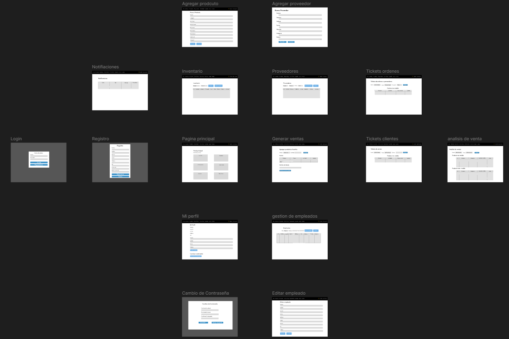

# SistemaDeInventarioFidel

## ESTE PROYECTO FUE REALIZADO POR:
- Bustillos Landa Guimel  
- Cazares Rochin Ricardo  
- Orduño Angulo Gustavo  
- Ruiz Arias Omar  
- Vega Garcia Susana Valentina  

## 1. INTRODUCCIÓN
El sistema es una aplicación web diseñada para facilitar el control de productos y existencias en pequeñas y medianas empresas mediante una solución sencilla y centralizada. Desarrollado en PHP con MySQL y ejecutado sobre XAMPP, el sistema integra en una sola plataforma la gestión de empleados, proveedores, productos, órdenes de compra y ventas de prueba, permitiendo mantener el inventario actualizado, trazable y respaldado con tickets y movimientos de stock.

## 2. RESUMEN DEL SISTEMA
Es un sistema web de gestión de inventario desarrollado en PHP con MySQL que permite a pequeñas empresas controlar sus existencias, proveedores y empleados desde un solo lugar. Incluye módulos para registrar y editar productos, definir niveles de stock mínimo y máximo, generar órdenes de compra a proveedores, registrar ventas de prueba y actualizar automáticamente las entradas y salidas de inventario.​

El sistema maneja usuarios con roles de administrador y empleado, incorpora autenticación con login, notificaciones automáticas cuando el stock llega a niveles críticos y mantiene un historial de movimientos de stock y tickets de órdenes y ventas de prueba para consulta y seguimiento.

## 3. REQUISITOS
### a.Requisitos funcionales

1. El sistema permite el **inicio de sesión de usuarios** mediante nombre de usuario y contraseña, diferenciando entre roles de **administrador** y **empleado**.  
2. El sistema permite al administrador **gestionar empleados**: registrar, editar y cambiar el estatus (**ACTIVO / INACTIVO**).  
3. El sistema permite **gestionar proveedores**: registrar, editar, cambiar estatus y evitar nuevos pedidos a proveedores inactivos.  
4. El sistema permite **registrar productos** asociados a un proveedor, incluyendo **precio de venta**, **stock actual**, **stock mínimo** y **stock máximo**.  
5. El sistema permite **editar e inactivar productos**, evitando su uso en ventas y órdenes cuando estén inactivos.  
6. El sistema permite **generar órdenes de compra** a proveedores con detalle de productos, cantidades, costos unitarios y monto total.  
7. El sistema **registra órdenes iniciales de stock** cuando se crea un producto con existencias iniciales.  
8. El sistema **actualiza automáticamente el stock** de productos al registrar órdenes de compra (entradas) y ventas de prueba (salidas).  
9. El sistema permite **registrar ventas de prueba** con detalle de productos, cantidades, precio unitario y total de la venta.  
10. El sistema **genera y muestra tickets** de órdenes a proveedores y tickets de ventas de prueba para consulta posterior.  
11. El sistema mantiene un **historial de movimientos de stock** por producto, indicando tipo de movimiento, cantidad, motivo y referencia.  
12. El sistema genera **notificaciones de stock** cuando el stock de un producto es menor o igual al mínimo o mayor o igual al máximo configurado.  
13. El sistema permite **consultar el inventario** con filtros por nombre, categoría, proveedor y estatus del producto.  
14. El sistema permite al usuario autenticado **consultar y actualizar su propio perfil**, incluyendo cambio de contraseña.  

### b.Requisitos no funcionales

1. El sistema está implementado como una **aplicación web monolítica** en **PHP** con base de datos **MySQL**, ejecutándose sobre **XAMPP** en entorno local.  
2. El sistema responde a las operaciones típicas de consulta (listar productos, proveedores, tickets) en un **tiempo adecuado** para una base de datos de tamaño pequeño–medio.  
3. El sistema **requiere autenticación** para acceder a cualquier funcionalidad distinta al formulario de inicio de sesión.  
4. El sistema **restringe el acceso** a funcionalidades administrativas (gestión de empleados, proveedores, productos, órdenes) exclusivamente a usuarios con rol **administrador**.  
5. El sistema mantiene la **integridad referencial** de la base de datos mediante claves foráneas, impidiendo eliminar entidades que tengan registros relacionados.  
6. El sistema es accesible desde **navegadores web modernos** y ofrece una **interfaz sencilla**, basada en menús y tablas, comprensible para usuarios no técnicos.  
7. El sistema **almacena las contraseñas** de usuarios utilizando funciones de **hash** seguras provistas por PHP, evitando guardar claves en texto plano.  
8. El sistema permite realizar **copias de seguridad y restauración** de la información mediante exportación e importación de la base de datos en formato **SQL**.  

## 4. CASOS DE USO
### a. Diagrama

### b. Descripción 
falta
## 5. ENTIDADES, ATRIBUTOS Y RELACIONES INCLUYENDO CARDINALIDAD, DIAGRAMA ENTIDAD RELACIÓN

## 6. ARQUITECTURA DEL SISTEMA
Es una arquitectura monolítica PHP por módulos con capas básicas.

### TIPO DE ARQUITECTURA
- **Monolito web:** Todo el sistema vive en una misma aplicación PHP dentro de XAMPP.  
- **Patrón por páginas:** Cada archivo `.php` actúa como controlador de una funcionalidad específica.  

### CAPAS
- **Presentación:** HTML y CSS en los mismos `.php`.  
- **Lógica de aplicación:** Código PHP que valida roles, procesa formularios y ejecuta la lógica de negocio.  
- **Acceso a datos:** `db.php` centraliza la conexión.

### ORGANIZACIÓN POR MÓDULOS
- Módulos funcionales: inventario, proveedores, empleados, tickets, pruebas, perfil, cada uno con sus páginas CRUD y vistas.  
- Reutilización básica: archivos compartidos (`db.php`, `auth_middleware.php`, `stock_notificaciones.php`, `header.php`, `navbar.php`, `footer.php`) usados en todo el sistema.
## 7. DISEÑO DE LA INTERFAZ (FIGMA)

[]
(https://www.figma.com/design/tV3GLAKigTK7OUxLz2nHAS/Login-fidel?node-id=0-1&t=qbs3Jjmn3ZzE1pmE-1)
## 8. ESTRUCTURA DEL PROYECTO

- `README.md`  
  Documentación general del sistema.

- Carpeta `DB/`  
  - `inventario_sistema.sql`  
    Script SQL para crear la base de datos del sistema.

- Carpeta `PNG/`  
  Imágenes y diagramas del proyecto (diagramas ER, casos de uso, etc.).

- Carpeta `app/`  
  Código fuente principal de la aplicación web:
  
  - `index.php`  
    Página de inicio / dashboard del sistema.

  - `login.php`, `logout.php`  
    Manejo de inicio y cierre de sesión de usuarios.

  - `db.php`  
    Conexión centralizada a la base de datos MySQL.

  - `auth_middleware.php`  
    Validación de sesión y permisos según el rol (ADMINISTRADOR / EMPLEADO).

  - `header.php`, `navbar.php`, `footer.php`  
    Plantillas compartidas para cabecera, menú de navegación y pie de página.

  - `styles.css`  
    Hoja de estilos principal del sistema.

  - Carpeta `IMG/`  
    Recursos gráficos utilizados por la aplicación (logos, iconos, etc.).

  - Módulo **Empleados**  
    - `empleados_list.php`  
    - `empleados_form.php`  
    - `empleados_save.php`  
    Listado, alta/edición y actualización de empleados.

  - Módulo **Proveedores**  
    - `proveedores_list.php`  
    - `proveedores_form.php`  
    - `proveedores_save.php`  
    Gestión de proveedores y preparación de órdenes.

  - Módulo **Inventario / Productos**  
    - `inventario_list.php`  
    - `inventario_form.php`  
    - `inventario_save.php`  
    Administración de productos, stock y proveedor asociado.

  - Módulo **Órdenes a proveedores**  
    - `orden_proveedor_form.php`  
    - `orden_proveedor_guardar.php`  
    - `tickets_ordenes.php`  
    Registro de órdenes de compra (NORMAL e INICIAL) y consulta de tickets.

  - Módulo **Ventas de prueba**  
    - `ventas_prueba.php`  
    - `ventas_prueba_guardar.php`  
    - `tickets_ventas_prueba.php`  
    Simulación de ventas y generación de tickets de prueba.

  - Módulo **Notificaciones y movimientos**  
    - `notificaciones_list.php`  
    - `movimientos_stock_list.php`  
    Consulta de alertas de stock y del historial de movimientos de inventario.

  - Módulo **Perfil de usuario**  
    - `perfil.php`  
    - `cambiar_password.php`  
    Gestión de datos personales y cambio de contraseña del usuario.​
## 9. INSTALACIÓN Y CONFIGURACIÓN (Guía de instalación y configuración)

### 1. Requisitos previos

1. Tener instalado **XAMPP** (o similar) con:
   - Apache  
   - MySQL  
2. Contar con un navegador web (Chrome, Firefox, Edge, etc.).

---

### 2. Descargar el proyecto desde GitHub

1. Entrar al repositorio:  
   `https://github.com/LinkTrifuerza/SistemaDeInventarioFidel`  
2. Hacer clic en el botón verde **Code** → **Download ZIP**.  
3. Descomprimir el archivo ZIP en tu computadora.  
4. Dentro de la carpeta descomprimida encontrarás, entre otros:
   - Carpeta `app/`  (código PHP + imágenes).  
   - Carpeta `DB/`   (script de base de datos `inventario_sistema.sql`).  
   - Carpeta `PNG/`  (diagramas e imágenes del proyecto).

---

### 3. Copiar el proyecto a `htdocs`

1. Abrir la carpeta descomprimida del proyecto.  
2. Copiar todo el contenido del repositorio (incluyendo `app`, `DB`, `PNG`, `README.md`, etc.).  
3. Pegar ese contenido dentro de la carpeta `htdocs` de XAMPP, por ejemplo:

C:\xampp\htdocs\SistemaDeInventarioFidel\

De forma que queden rutas como:

C:\xampp\htdocs\SistemaDeInventarioFidel\app\login.php
C:\xampp\htdocs\SistemaDeInventarioFidel\DB\inventario_sistema.sql

---

### 4. Crear la base de datos en MySQL (phpMyAdmin)

1. Abrir **XAMPP** y encender:
- Apache  
- MySQL  
2. En el navegador, ir a:  
`http://localhost/phpmyadmin`  
3. Hacer clic en la pestaña **Importar**.  
4. Pulsar **Seleccionar archivo** y elegir:

C:\xampp\htdocs\SistemaDeInventarioFidel\DB\inventario_sistema.sql

5. Dejar las opciones por defecto y hacer clic en **Continuar**.  
6. Se creará la base de datos **`inventario_sistema`** con todas las tablas necesarias.

---

### 5. Verificar la conexión a la base de datos

1. Abrir el archivo:

C:\xampp\htdocs\SistemaDeInventarioFidel\app\db.php

2. Comprobar que los datos de conexión coinciden con tu entorno XAMPP (por defecto):

$host = 'localhost';
$db = 'inventario_sistema';
$user = 'root';
$pass = '';

3. Si tu usuario o contraseña de MySQL son diferentes, modificarlos aquí y guardar el archivo.

---

### 6. Iniciar el servidor y acceder al sistema

1. Asegurarse en XAMPP de que **Apache** y **MySQL** estén en ejecución.  
2. En el navegador, ir a:

http://localhost/SistemaDeInventarioFidel/app

3. Iniciar sesión con un usuario registrado o si no registrarse con sus datos, si elige el rol de administrador, deberá ingresar la contraseña de administrador para poder continuar con el proceso.  
4. Una vez autenticado, se podrá acceder al menú principal y a todos los módulos del sistema (empleados, proveedores, inventario, órdenes, ventas de prueba, notificaciones, etc.).

## 10. USO Y OPERACIÓN DEL SISTEMA

### 1. Inicio de sesión

1. Accede a la URL del sistema:  

http://localhost/SistemaDeInventarioFidel/app

2. Ingresa tu **usuario** y **contraseña**.  
3. Según tu rol (**ADMINISTRADOR** o **EMPLEADO**) se habilitarán diferentes opciones en el menú principal.

---

### 2. Gestión de empleados (solo administrador)

1. En el menú, ir a **Empleados**.  
2. Desde esta sección puedes:
- Ver la lista de empleados registrados.  
- Crear un nuevo empleado con botón **Nuevo**.  
- Editar un empleado existente con el botón **Editar**.  
3. En el formulario de edición puedes cambiar datos personales, rol y estatus (ACTIVO/INACTIVO).

---

### 3. Gestión de proveedores

1. En el menú, ir a **Proveedores**.  
2. Funciones disponibles:
- Registrar nuevos proveedores.  
- Editar datos de proveedores existentes.  
- Cambiar estatus a **INACTIVO** para dejar de usarlos en órdenes.  
3. Solo los proveedores en estado **ACTIVO** permiten generar órdenes de compra.

---

### 4. Gestión de productos e inventario

1. En el menú, ir a **Inventario**.  
2. Desde esta sección puedes:
- Ver la lista de productos con su stock actual, mínimo y máximo.  
- Registrar nuevos productos indicando proveedor, precio de venta y niveles de stock.  
- Editar productos ya registrados.  
- Inactivar productos para que dejen de usarse en ventas y órdenes.  
3. Al crear un producto con stock inicial, el sistema puede generar una **orden inicial** que registra esa primera entrada al inventario.

---

### 5. Órdenes de compra a proveedores

1. En **Proveedores**, para un proveedor ACTIVO, usar la opción **Hacer pedido**.  
2. Se abrirá el formulario de orden donde se seleccionan:
- Productos.  
- Cantidades.  
- Costos unitarios.  
3. Al guardar:
- Se genera un **ticket de orden**.  
- Se actualiza el **stock de los productos** (entrada).  
- Se registra el movimiento en el historial de stock.  
4. Las órdenes generadas pueden consultarse en **Tickets de órdenes**.

---

### 6. Ventas de prueba

1. En el menú, ir a **Ventas de prueba**.  
2. Selecciona productos y cantidades para simular una venta.  
3. Al guardar:
- Se genera un **ticket de venta de prueba**.  
- Se descuenta el stock de los productos involucrados (salida).  
4. Los tickets pueden consultarse en **Tickets de ventas de prueba**.

---

### 7. Notificaciones y movimientos de stock

1. En el menú, ir a **Notificaciones** para ver alertas cuando un producto:
- Llega al **stock mínimo**.  
- Supera el **stock máximo** configurado.  
2. En **Movimientos de stock** puedes consultar el historial de:
- Entradas por órdenes de compra o altas iniciales.  
- Salidas por ventas de prueba u otros motivos.

---

### 8. Perfil de usuario y cambio de contraseña

1. En el menú, ir a **Perfil**.  
2. Desde esta sección puedes:
- Ver y actualizar tus datos básicos.  
- Cambiar tu contraseña en la opción correspondiente (ingresando la contraseña actual y la nueva).  

Tras cada operación importante (crear, editar, inactivar, registrar órdenes o ventas), el sistema devuelve al listado correspondiente para que puedas verificar los cambios realizados.

## 11. BASE DE DATOS

El script SQL para crear la base de datos está en:

- [`inventario_sistema.sql`](DB/inventario_sistema.sql)

## 12. CONCLUSION ACERCA DEL TRABAJO

Desarrollar este sistema de inventario fue una experiencia en la que se pusieron en práctica muchos conceptos vistos en clase y que permitió afianzarlos en un proyecto real, a lo largo del desarrollo se aprendió a diseñar y normalizar una base de datos, a estructurar una aplicación web en PHP por módulos, a manejar correctamente claves foráneas e integridad referencial, y a trabajar con control de versiones usando Git y GitHub, lo que acercó el proyecto a una forma de trabajo más profesional.​​

Además, el proceso hizo evidente la importancia de pensar en la experiencia del usuario y en los pequeños detalles: validaciones, mensajes claros, flujos coherentes para altas, ediciones e inactivaciones, y la necesidad de mantener un equilibrio entre funcionalidad y simplicidad. En general, el proyecto resultó retador pero satisfactorio, dejando la sensación de haber construido una herramienta útil y al mismo tiempo haber ganado confianza para abordar sistemas más complejos en el futuro.

